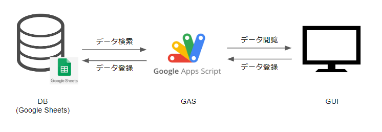

# 要件定義
## 初めに
### 本書の目的
本書は Webアプリケーション「Drill Maker」におけるアプリケーション要件を定義する。

### 用語定義

| 用語             | 説明                                                                                  |
| ---------------- | ------------------------------------------------------------------------------------- |
| GAS              | Google App Scriptのことを指す。Google社が提供するアプリケーション開発プラットフォーム |
| スプレッドシート | Google社が提供する表計算ソフトウェア                                                  |

## 概要
### システム構成
プロジェクトで構築予定のツール構成は以下の通り。GASおよびスプレッドシートを用いて、Webアプリケーションを構築する

### 機能一覧

| 機能名       | 説明                                                                                                                                                                               |
| ------------ | ---------------------------------------------------------------------------------------------------------------------------------------------------------------------------------- |
| 問題管理機能 | WebGUIから問題の登録・変更ができる。 ・カテゴリやタグを利用して問題ごとにグルーピングをすることができる ・キーポイントを設定して、回答採点機能の採点基準を作成することができる。           |
| 回答採点機能 | ドリル問題に対して、回答入力およびキーポイントを用いての採点をすることができる ・問題作成・変更時に作成したキーポイントを用いて回答に対して複数ポイントをとらえた回答か判断することができる。 |
| 回答統計機能 | ドリル問題に対して、問題の回答数・正解数を管理する。 ・回答数 / 誤答数 / 直近の回答状況 / 累積正解数などの情報から問題の情報を記録することができる。                              |

### 作成ドキュメント

| ドキュメント種別     | ファイル名              | 備考                                                         |
| -------------------- | ----------------------- | ------------------------------------------------------------ |
| 要件定義書           | 要件定義.md             | 本書                                                         |
| 基本設計書（WebGUI） | 基本設計書（WebGUI）.md | 本要件に沿った基本設計書。 WebGUIに関する仕様を記載する。 |
| 要件定義書（DB）     | 基本設計書（DB）.md     | 本要件に沿った基本設計書。 DBに関する仕様を記載する。     |

## 変更履歴

| 版      | 日付       | 担当 | 変更内容     |
| ------- | ---------- | ---- | ------------ |
| Draft A | 2022/10/10 | 林   | Draft A 作成 |